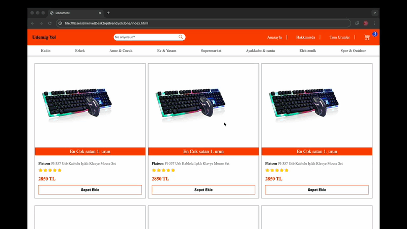

🛍️ Trendyol Clone
Trendyol'un kullanıcı arayüzünden ilham alınarak geliştirilmiş, modern ve responsive bir e-ticaret web sitesi klonu.
Show Image
📸 Önizleme
Bu proje, Trendyol'un tasarım prensiplerini ve kullanıcı deneyimini taklit eden tam fonksiyonel bir e-ticaret arayüzü sunar.
✨ Özellikler

🎨 Modern ve Şık Tasarım - Trendyol'un orijinal tasarımına sadık, temiz ve profesyonel arayüz
📱 Responsive Tasarım - Mobil, tablet ve masaüstü cihazlarda mükemmel görünüm
🛒 Ürün Listeleme - Grid layout ile düzenli ürün kartları
⭐ Ürün Detayları - Ürün puanlaması, fiyat gösterimi ve "En Çok Satan" rozetleri
🔍 Arama Fonksiyonu - Kullanıcı dostu arama çubuğu
🧭 Navigasyon Menüsü - Kategorilere göre düzenlenmiş menü sistemi
🛍️ Sepet Sistemi - Ürün ekleme ve sepet yönetimi arayüzü
👤 Kullanıcı Hesap Alanı - Hesap yönetimi ve kullanıcı işlemleri

🎯 Kategoriler

Kadın
Erkek
Anne & Çocuk
Ev & Yaşam
Süpermarket
Ayakkabı & Çanta
Elektronik
Spor & Outdoor

🛠️ Teknolojiler

HTML5 - Semantik ve modern HTML yapısı
CSS3 - Flexbox/Grid, animasyonlar ve responsive tasarım
Vanilla JavaScript - DOM manipülasyonu ve interaktif özellikler

📊 Proje Durumu
🚧 Aktif Geliştirme Aşamasında
Yapılacaklar

 Ürün detay sayfası
 Sepet fonksiyonalitesi
 Kullanıcı giriş/kayıt sistemi
 Ödeme sayfası tasarımı
 Ürün filtreleme ve sıralama
 Dark mode desteği
 
 <h2>Ekran Görüntüsü</h2>
 
Not: Bu proje yalnızca eğitim amaçlı ve geliştirme aşamasındadır